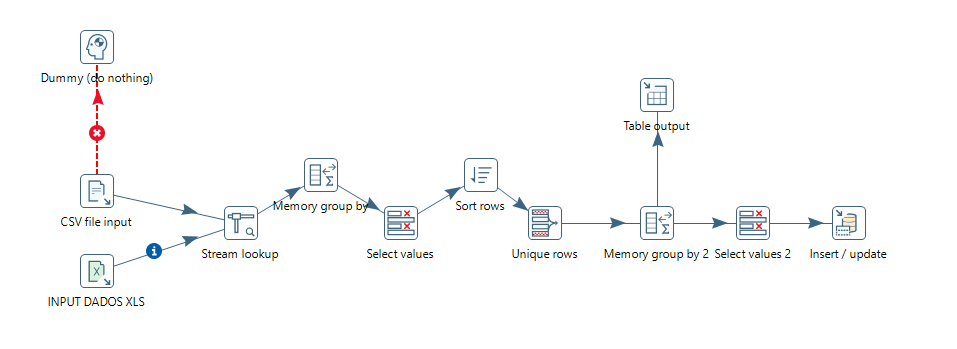
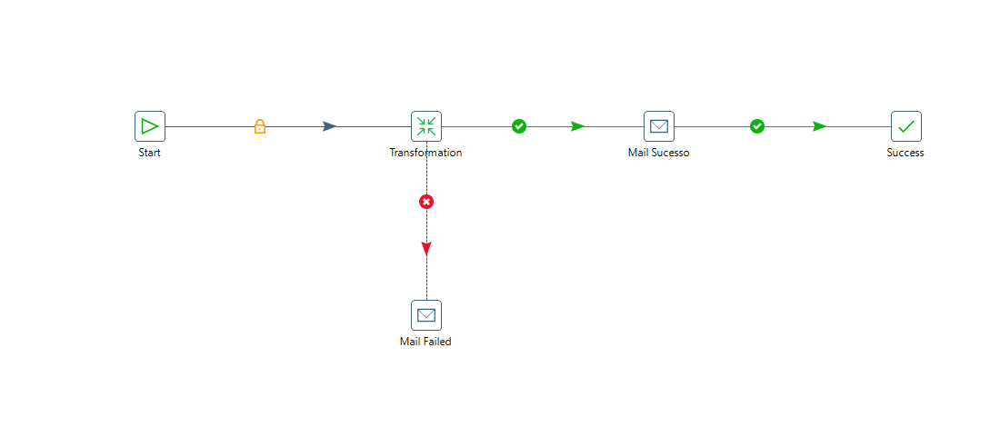

# Tratamento de Dados com Pentaho 
Esse projeto faz o tratamento de dados a partir de um arquivos CSV e XLS com dados da Coordenação de Aperfeiçoamento de Pessoal de Nível Superior (CAPES),
onde é enviado os dados para um banco de dados postgresql desenvolvido em ambiente linux na Cloud Azure.
Com a utilização da ferramenta Pentaho Data Integration é feito o carregamento desses dados, o filtro e o envio para as tabelas DM que serão consumidas
pelas aplicações. Por fim, é iniciado o JOB que envia uma mensagem no e-mail caso o processo tenha sido concluído com êxito ou não.

### Requisitos:
- Banco de Dados Postgresql 12 ou versão superior
- Pentaho Data Integration
- JRE e JDK do Java 8 ou versão superior

### Estrutura de pasta:
```
.
│   README.md
│
├───img
│       Diagrama em branco.png
│       JOB.png
│       Transformation.png
│
└───Pentaho
    ├───Jobs
    │       Job.kjb
    │
    └───Transformação
            Transformação.ktr
```

### Diagrama do fluxo:


### Pentaho Data Integration - Transformação:


### Pentaho Data Integration - Trabalhos:


### Considerações finais:
- **@Desenvolvedor:** Mateus Santos de Jesus
- **@Linkedin:** https://www.linkedin.com/in/mateus-santos-de-jesus-9819a8186